# Architecture Diagrams - Supplier Selection App

## 1. System Architecture (4-Layer)

## 2. Data Flow

## 3. Database Schema

## 4. Module Dependencies

## 5. User Workflow

```mermaid
flowchart TD
    Start([Start]) --> NewProject{New or<br/>Existing?}
    
    NewProject -->|New| CreateProj[Create Project]
    NewProject -->|Existing| OpenProj[Open Project]
    
    CreateProj --> AddCriteria[Add Criteria]
    OpenProj --> AddCriteria
    
    AddCriteria --> AddAlts[Add Alternatives]
    AddAlts --> AddExperts[Add Experts]
    AddExperts --> AHPInput[AHP Comparisons]
    
    AHPInput --> CalcWeights[Calculate Weights]
    CalcWeights --> CheckCR{CR ≤ 0.1?}
    
    CheckCR -->|No| AHPInput
    CheckCR -->|Yes| TOPSISInput[TOPSIS Ratings<br/>7-Level Scale]
    
    TOPSISInput --> CalcTOPSIS[Calculate Rankings]
    CalcTOPSIS --> ViewResults[View Results]
    ViewResults --> Export[Export Excel]
    Export --> End([End])
    
    style TOPSISInput fill:#90EE90
```

## 6. TOPSIS Algorithm

## 7. Database ERD (Detailed with Fields)

## 8. Component Dependency (Detailed)

## 9. Admin Workflow with File Exchange

```mermaid
flowchart TB
    Start([Admin]) --> Setup[1. Setup Project<br/>Criteria, Suppliers, Experts]
    Setup --> ExportDB[📤 2. Export Project File<br/>.db or Excel Template]
    
    ExportDB --> ShareFile[📧 Share with Experts<br/>Email/Cloud Storage]
    ShareFile --> Wait[⏳ Wait for Expert<br/>Evaluations]
    Wait --> ImportFile[📥 3. Import Expert Files<br/>AHP + TOPSIS Data]
    
    ImportFile --> CheckCR{Check CR<br/>≤ 0.1?}
    CheckCR -->|No| ShareFile
    CheckCR -->|Yes| TOPSIS[4. Run TOPSIS<br/>View Rankings]
    
    TOPSIS --> Analysis[5. Sensitivity<br/>Analysis]
    Analysis --> Scenarios{Create<br/>Scenarios?}
    Scenarios -->|Yes| NewScenario[Create Scenario<br/>Share with Experts]
    NewScenario --> Wait
    Scenarios -->|No| FinalExport[📤 6. Export Final<br/>Report Excel]
    FinalExport --> End([End])
    
    style Setup fill:#FFE4B5
    style ExportDB fill:#FFD700
    style ImportFile fill:#FFD700
    style TOPSIS fill:#90EE90
    style Analysis fill:#87CEEB
```

## 10. Expert Workflow with File Exchange

---

## How to Use

1. **View in GitHub/GitLab**: Renders automatically
2. **Mermaid Live**: Copy code to https://mermaid.live/
3. **Export**: PNG, SVG, or PDF
